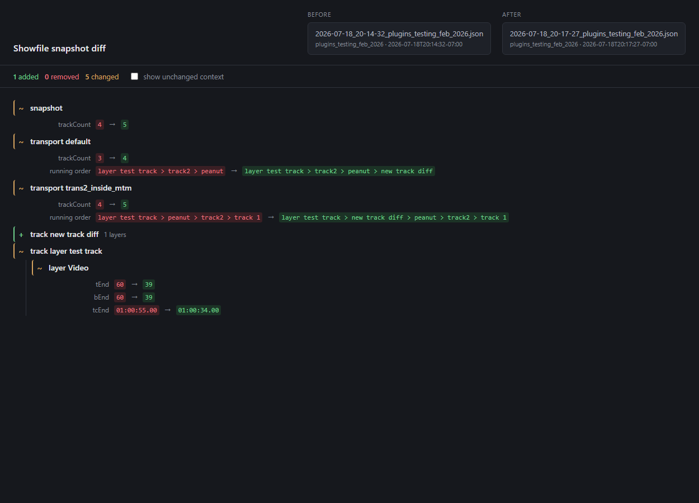

# Showfile snapshot diff

Visual diff for two `susan_summary` snapshot logs — what changed in the showfile
between one capture and the next.

`susan_summary` is a [disguise](https://www.disguise.one/) d3 plugin that
periodically captures a JSON snapshot of the showfile — transports, tracks,
layers, media and cues — to disk. This repo doesn't produce those snapshots;
it just reads two of the plugin's JSON captures and renders a semantic tree
diff between them, so you can see what actually changed in a show over time
without combing through raw JSON.



*(The screenshot predates the tabs; it shows the Changes tab only.)*

## Use it

This is designed to run entirely in the browser, client-side, with no build
step and no server. Use it hosted at **https://macswg.github.io/d3_snapshot_diff/**,
or open `index.html` locally straight from disk — both work identically since
nothing leaves the browser.

Pick a **Before** and an **After** (click or drag), and read the tree. That's
the whole thing.

**Choose folder…** does it in one step: point it at a captures directory and it
loads the two most recent snapshots, previous into Before and latest into After.
Order comes from the timestamp at the head of the filename
(`2026-07-18_20-17-27_…`), falling back to the file's own date for names without
one — the toolbar says how many were ordered that way.

## Reading the output

| sigil | meaning |
|-------|---------|
| `+`   | present in After, not Before |
| `−`   | present in Before, not After |
| `~`   | present in both, with changed fields |
| `↕`   | on both setlists, in a different place (running order only) |

Changes nest: a changed track lists its changed cues and layers, and a changed
layer lists its changed media. Unchanged entities are omitted entirely — the
tally in the toolbar counts every node in the tree, including nested ones.

### Setlists are not the showfile

A capture's top-level `tracks` array is only the union of what the setlists
reference, so editing a setlist changes which tracks are in the file at all.
Read naively that is a wall of deletions: dropping a hundred songs from a
setlist used to report as a hundred tracks removed from the show, which is not
what happened and buried the two edits that were real.

So **an added or removed track always means the showfile**, never the setlist.
Setlist membership is reported where it belongs — as lines on the transport's
running order.

Telling those apart needs a capture that knows the whole show. v5 captures one:
`showfile.trackIds`, which the plugin reads off the **automatic setlist**
resource — the setlist that holds every track in the show — regardless of what
any transport is loaded with. A track that leaves that list really was deleted,
and is reported as such.

`trackIds` is `null`, never `[]`, when the plugin could not read that resource:
an empty show and an unreadable one are opposite answers, and conflating them
would report every track in the show as deleted. On `null` the viewer falls back
to a transport that happens to be sitting on `automatic`, whose `trackRefs` are
the same census by a less reliable route. With neither, the question is
unanswerable, and the viewer says so in a note above the tree rather than
guessing:

> Not counted as deletions: 68 tracks that left the capture by dropping off a
> setlist. The After capture carries no census of the showfile, which is the
> only thing that lists every track in the show, so this pair cannot tell a
> showfile edit from a setlist edit.

Before v5 that fallback was the *only* route, which made the answer depend on
what someone happened to have loaded when the timer fired — the reason a capture
taken three minutes later could report 68 phantom deletions.

For the same reason `trackCount` is never printed under that name. At snapshot
level it reads **tracks in setlists** and at transport level **tracks in
setlist**, because that is what it counts — a show with 127 tracks and one
25-track setlist loaded reports 59, not 127.

### Tracks in the trash

d3 keeps a deleted track under `trash/`, and a setlist can go on referencing it.
It plays like any other song, and it is never in the census — so without being
told, nothing in the output gives it away.

v5 captures `trashed` per track, and every tab says so: the tree marks it on the
track's row and reports a track moving to the trash as a change like any other,
while the media report and transport info badge it in the removed colour beside
the track name. Searching `trash` answers "does any setlist still play something
I deleted", which is the question worth asking — and transport info tells you
which setlist.

### Running order

A transport's setlist is rendered as a collapsible block, one track per line,
rather than as two `a > b > c` strings — a setlist runs past a hundred entries
and the joined form was unreadable exactly when it mattered. Each line carries
its position on both sides:

```
running order  126 → 25 tracks  −101  ↕13 moved  12 in place
   1   ·  −  000_pipe
  10  12  ↕  120_liquid_outlaw
  19   7     150_bells_for whom the bell tolls
```

Positions are 1-based and `·` means absent from that side. Tracks on both
setlists are matched by a longest-common-subsequence pass, so a reshuffle reads
as `↕ moved` lines rather than as a hundred removals paired with a hundred
additions somewhere further down. Blocks over twelve lines start collapsed, and
open automatically while a search is running.

### Summary

Above the tree, three columns: what changed per entity type, the fields that
changed most often, and the tracks carrying the most changes.

**The field ranking is the part worth reading first.** A pair of captures can
report hundreds of changes and mean very little: if 205 of them are `media
version`, that is a re-link or re-scan, not editorial work. The headline
add/remove/change counts cannot tell those apart; the field ranking can, and it
says so outright when one field dominates.

## Media report

The second tab is not a diff. It is a plain inventory of the **After snapshot
alone** — every track in it and what each one is programmed with — and it
ignores Before entirely. It answers "what is loaded, and which version", which
the diff deliberately never says.

One row per media file under each track: filename, version, layer, flags, and
the layer's in and out times. Rows are in timeline order, so reading down a
track is reading the track. Tracks start collapsed — 127 of them would otherwise
open some 1,700 rows — and the closed line still gives length, bpm and media
count, which is usually the question. `expand all` when it isn't.

The version column is fixed-width and aligned across the whole report, because
running an eye down it is the point.

**Setlists are not part of this.** An earlier version grouped by transport, and
it was wrong in a way worth recording: a track on three setlists was listed
three times and its media counted three times, so a show holding 1,734 media
reported 2,931 — an inventory whose total is not the inventory. What is
programmed in a track does not depend on who plays it. Setlists are the diff
tab's business, where a running order is genuinely what changed.

So: every track once, in the order the capture wrote them, which is by id — the
report reads alphabetically and a track keeps its place between captures.

Two other differences from the diff tab:

- **It works with only After loaded.** The diff needs two snapshots; an
  inventory needs one.
- **Tracks in the trash are badged**, since a track that has been deleted can
  still be programmed and still be played. See
  [Tracks in the trash](#tracks-in-the-trash).

`mediaReport(snap)` builds it, is DOM-free like the rest of `diff.js`, and is
covered by the self-test.

## Transport info

The third tab: what each transport is loaded with. A section per transport —
its setlist, and the tracks on it **in running order**.

Deliberately **no media**. A setlist is a running order, and 1,700 clip rows
underneath one is exactly what made the combined view unreadable; that is why
this and the media report are separate tabs rather than one screen. The two
answer different questions and the answers have different shapes:

| | question | a track on three setlists |
|---|---|---|
| Media report | what is programmed | listed **once** |
| Transport info | what is each transport playing | listed **three times**, correctly |

Transports start collapsed — one of them may be on `automatic` and hold every
track in the show. A setlist naming a track that is not in the capture is shown
as `missing` rather than dropped: it is a real fault in the show, and silently
omitting it is how it stays one. Tracks in the trash are badged here too.

`transportReport(snap)` builds it, is DOM-free like the rest of `diff.js`, and
is covered by the self-test.

## Search

One box, serving whichever tab is showing; the query survives a switch between
them.

On the tree it filters as you type, over everything you can read on a row —
labels, field names, and both values. Space-separated terms are ANDed, and each
term may match anywhere on the path from the top-level node down, so `whiskey
cue` finds the cues inside `290_whiskey_whiskey` even though no cue's own text
contains "whiskey". Track titles inside a running order are searchable too,
folded or not.

On the media report it matches track names, filenames, versions and layer names.
On transport info it matches transport names, setlists and track names.

In all three, a row kept only to place a match further down is dimmed: it is
context, not a hit. The count is of actual hits. Escape clears.

## Logs on a shared drive

Google Drive for desktop mounts Drive as an ordinary folder
(`~/Library/CloudStorage/GoogleDrive-<account>/…` on macOS,
`G:\My Drive\…` on Windows), so **Choose folder…** picks a shared captures
directory exactly like a local one — the picker never learns it is a network
mount. Dropbox, OneDrive and an SMB share all work the same way.

One caveat: files Drive is holding *online only* have no bytes on disk, and
reading one can stall or fail. Right-click the captures folder → **Available
offline** and that stops.

There is deliberately no Drive API integration. It would need OAuth, client
credentials and a server to hold them — a build step and a deployment, for the
sole benefit of not clicking a file. If a browser-side Drive picker ever
genuinely matters, that is the moment to reconsider, not before.

## Semantic, not textual

Entities are matched by **identity, never array position**:

| entity    | identity                               |
|-----------|----------------------------------------|
| track     | `id`, which v5 derives from its resource path |
| layer     | `groupPath` + `name`, within its track |
| media     | `path` (falls back to `name`)          |
| cue       | `beat`                                 |
| transport | `name`                                 |

A layer inserted at the top of a track is therefore **one addition**, not "every
layer below it moved". That is the whole reason this exists instead of `diff`.

Consequences worth knowing:

- **Tracks shared between setlists diff once.** The schema stores each track once
  in a top-level `tracks` array with transports holding `trackRefs`; a track on
  two setlists produces one node, not one per referencing transport.
- **A reordered setlist is a real change.** `trackRefs` order is compared as
  running order, so a reshuffled show reports even when no track in it was
  touched — but as transport lines, never as track adds and deletes. See
  [Setlists are not the showfile](#setlists-are-not-the-showfile).
- **Media swaps read as remove + add**, not `path: old → new`, because media
  identity *is* the path. A different clip is a different resource, not an
  edited one.
- **Derived counters are not compared.** `layerCount` on a track follows from
  `layers`; comparing it as well would report every structural edit twice.
  (`trackCount` *is* compared, at both levels, where it summarises a `trackRefs`
  change usefully — printed as "tracks in setlist(s)", since that is what it
  counts.)
- **Floats compare with a 1e-6 tolerance.** Beats and times are re-derived
  through the director each capture, so a position that comes back as
  `60.0000000001` is the same position, not an edit.

## Schema

Reads **v5 only**, and refuses anything else at load with a message naming the
version. There is deliberately no back-compatibility, including with v4.

A v1 log has a top-level `transport` with tracks inline rather than referenced,
so identity matching cannot line up at all. v4 is subtler and worse: it lines up
and lies quietly. Its track ids are display names disambiguated with a ` #2`
counter minted in capture order, so two tracks sharing a name can swap ids
between runs and report one whole track removed and another added for a showfile
where nothing moved. It also has no `showfile` census, so it cannot tell a
deleted track from one dropped off a setlist. Rendering either is worse than
refusing.

v5 fixes both at the source: ids key on the track's resource path, and the
census is captured explicitly.

Bump the check in `index.html` alongside `SCHEMA_VERSION` in the plugin's
`snapshot.py`, and add any new comparable fields to the field lists at the top
of `diff.js`.

## Layout

```
index.html        UI, all three tabs, rendering and file loading. All the CSS.
diff.js           The engine. No DOM access — usable from node.
tools/selftest.js Regression checks against real captures.
tools/deploy.sh   Version bump, commit, push, wait for Pages.
```

`diff.js` exports `diffSnapshots(a, b)` under CommonJS as well as defining it
globally for the page, which is why the self-test can `require` it directly.

`diffSnapshots` returns:

```js
{
  meta:   { a: {capturedAt, project, version}, b: {…} },
  counts: { added, removed, changed },
  notes:  [ "Not counted as deletions: …" ],   // what the diff withheld, and why
  nodes:  [ { kind, entity, label, detail?,
              changes?: [{field, from, to}],
              order?:   { entries: [{kind, id, a, b}], counts: {…} },  // transports
              children?: [] } ]
}
```

`order` is a running order rather than a field change, because it is a list and
the page renders it a line at a time. Entry `kind` is `same`, `moved`, `added`
or `removed`; `a` and `b` are 0-based positions on each side, `null` where
absent. Its lines are deliberately not nodes and do not enter `counts` — a
reshuffled setlist is one edit, and letting a hundred lines into the tally would
drown out everything else. They do weigh in `hotspots`, where "which setlist
took the most damage" is the question being asked.

`notes` is non-empty whenever the diff declined to report something. A quieter
tally earned by withholding has to say so, or it reads as "nothing happened".

`entity` is one of `snapshot`, `transport`, `track`, `layer`, `cue`, `media`.
It is carried on the node rather than parsed back out of the label, so the
summary never has to guess what a row is.

`mediaReport(snap)` builds the media tab from a single snapshot, and is likewise
DOM-free:

```js
{
  tracks: [ { id, name, lengthInSec, bpm, trashed, items: [
    { layer, group, type, renderEnable, tStart, tEnd,
      name, path, version, hasAudio, regionSet } ] } ],
  totals: { tracks, media }
}
```

`items` is one row per media, not per layer, sorted by `tStart` with nulls last.
It reads `snap.tracks` and never looks at `transports`, so every track appears
exactly once and `totals.media` is the media in the capture rather than a sum
over setlists.

`transportReport(snap)` builds the transport tab from a single snapshot, and is
likewise DOM-free:

```js
{
  transports: [ { name, setlist, error, trackCount, missingCount,
    tracks: [ { id, name, lengthInSec, bpm, trashed, missing } ] } ],
  totals: { transports, tracks }
}
```

`tracks` is in `trackRefs` order — the running order is the information, so it
is never sorted. `missing` marks a reference with no track in the capture. No
media: that is `mediaReport`'s job, and keeping them apart is the point.

`summarize(result)` rolls the diff tree up for the panel on the page, and is
likewise DOM-free:

```js
{
  entities: [ {entity, added, removed, changed, total} ],   // fixed display order
  fields:   [ {entity, field, count} ],                     // most-changed first
  hotspots: [ {label, kind, entity, count} ]                // top-level, heaviest first
}
```

## Deploying

GitHub Pages serves `main` at the repo root with no build step, so pushing is
the deploy. Do it through the script rather than by hand:

```
tools/deploy.sh "commit message"                 # patch: 1.0.0 -> 1.0.1
tools/deploy.sh minor "commit message"           # 1.0.0 -> 1.1.0
LOGS=/path/to/captures tools/deploy.sh "…"       # gate on the selftest
```

It bumps the version in the footer, commits, tags `vX.Y.Z`, pushes, then polls
the live page until it serves the new version — the Pages build API lags behind
the CDN, so the served file is the only honest signal that a deploy landed.

The version lives in exactly one place, the `#ver` span in `index.html`, and is
rewritten by the script. Don't edit it by hand; a footer nobody remembers to
update is worse than none, because it looks authoritative while being wrong.

The selftest gates the deploy when it can find captures to run against —
`LOGS`, or `../d3plg_susan_summary/example_logs` by default. If neither exists
the script warns and deploys anyway rather than blocking on a machine that
simply doesn't have the logs checked out.

## Tests

```
node tools/selftest.js [path/to/logs]
```

Defaults to `../d3plg_susan_summary/example_logs`. It needs at least two `.json`
captures there and compares the first against the last.

The cases run against **real captures rather than hand-written fixtures**,
because the fields that actually break are the ones nobody thinks to fake — null
timecode on a track with no TC tag, empty `media` arrays on a layer with no clip
assigned, tracks shared across transports. Each check corresponds to a claim
made above: identity, positional independence, shared-track dedup, float
tolerance, derived counters, running order, setlist-versus-showfile.

The setlist cases are the exception to fixture-free: they mark a transport
`automatic` and rewrite its `trackRefs` before comparing. Whether a capture
censuses the showfile is the whole question those cases ask, so it has to be set
rather than hoped for — the corpus a given machine has checked out may have no
automatic transport in it at all.

## Known gaps

- The diff is changed-only. Unchanged entities are never emitted, so there is no
  way to show surrounding context the way `diff -U` does.
- Only two snapshots at a time. A folder-wide timeline ("show me this project
  across the week") would need a different UI and is not built.
- The media report and transport info read **After only**. Neither marks what
  changed since Before — deliberately, since the tree already does comparison,
  but "which versions moved since yesterday" is a fair thing to want and is not
  answerable from the media tab today.
- `screenshot.png` is out of date: it predates the tabs and the v5 work.
- Narrow viewports are unverified. The media report's fixed column widths assume
  a desktop-width window.
